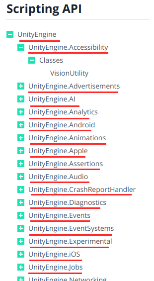
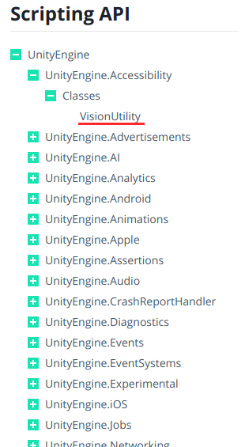

# About
Script to extract the api from [Unity](https://unity3d.com/) and save as json  
Web scraping on page https://docs.unity3d.com/ScriptReference/index.html  

# How to use
- Install [**node.js**](https://nodejs.org/en/)  
- Open terminal
  - Go to **unity-scrapping** directory  
  - `npm install`  
  - `node --max-old-space-size=4096 main.js`  
- Unity api inside **api.json**  

# How it work
It will navigate to unity website and read the HTML code to get what needed.  

## Requires
I will be reading this list  

|                          |
| ------------------------ |
|  | 

The HTML format to find requires is  
`<span>UnityEngine</span>`  

#### Array of requires  
```JSON
{
  "text": "UnityEngine",
  "type": "require"
},
{
  "text": "UnityEngine.Accessibility",
  "type": "require"
},
{
  "text": "UnityEngine.Advertisements",
  "type": "require"
},
...
```

## Objects
Objects can be class/enumerations/...  
I will be reading this list again  

|                          |
| ------------------------ |
|  |

The HTML format to find objects is  
`<a href="Accessibility.VisionUtility.html" id="" class="">VisionUtility</a>`  

#### Array of objects  
```JSON
{
  "text": "VisionUtility",
  "descriptionMoreURL": "https://docs.unity3d.com/2019.1/Documentation/ScriptReference/Accessibility.VisionUtility.html",
},
{
  "text": "Advertisement",
  "descriptionMoreURL": "https://docs.unity3d.com/2019.1/Documentation/ScriptReference/Advertisements.Advertisement.html",
},
{
  "text": "DebugLevel",
  "descriptionMoreURL": "https://docs.unity3d.com/2019.1/Documentation/ScriptReference/Advertisements.Advertisement.DebugLevel.html",
},
...
```

## Objects Information
Using the link we can access the object page and get more information about it  

|                          |
| ------------------------ |
|  |

The HTML format to find the description is  
`<h2>Description</h2><p>A class containing methods to assist with accessibility for users with different vision capabilities.</p>`  
It going to be a short description, so it will only get the text until the `</p>`

The HTML format to find the type is  
`<p class="cl mb0 left mr10">class in UnityEngine.Accessibility</p>`  
Is the first text after the `<p>` tag  

#### Update Array of objects  
```JSON
{
  "text": "VisionUtility",
  "descriptionMoreURL": "https://docs.unity3d.com/2019.1/Documentation/ScriptReference/Accessibility.VisionUtility.html",
  "description": "A class containing methods to assist with accessibility for users with different vision capabilities.",
  "type": "class"
},
{
  "text": "Advertisement",
  "descriptionMoreURL": "https://docs.unity3d.com/2019.1/Documentation/ScriptReference/Advertisements.Advertisement.html",
  "description": "Unity Ads.",
  "type": "class"
},
{
  "text": "DebugLevel",
  "descriptionMoreURL": "https://docs.unity3d.com/2019.1/Documentation/ScriptReference/Advertisements.Advertisement.DebugLevel.html",
  "description": "Player debug message level.",
  "type": "enumeration"
},
...
```

## Static Properties
We can find static properties searching the table  

|                          |
| ------------------------ |
|  |

The HTML format to find the propertie name, link, description   
`<td class="lbl"><a href="AI.NavMesh.AllAreas.html">AllAreas</a></td><td class="desc">Area mask constant that includes all NavMesh areas.</td>`  

#### Array of Properties   
```JSON
{
  "text": "NavMesh.AllAreas",
  "description": "Area mask constant that includes all NavMesh areas.",
  "descriptionMoreURL": "https://docs.unity3d.com/2019.1/Documentation/ScriptReference/AI.NavMesh.AllAreas.html",
  "type": "property"
},
{
  "text": "NavMesh.avoidancePredictionTime",
  "description": "Describes how far in the future the agents predict collisions for avoidance.",
  "descriptionMoreURL": "https://docs.unity3d.com/2019.1/Documentation/ScriptReference/AI.NavMesh-avoidancePredictionTime.html",
  "type": "property"
},
{
  "text": "NavMesh.onPreUpdate",
  "description": "Set a function to be called before the NavMesh is updated during the frame update execution.",
  "descriptionMoreURL": "https://docs.unity3d.com/2019.1/Documentation/ScriptReference/AI.NavMesh-onPreUpdate.html",
  "type": "property"
},
...
```

## Static Methods
We can find static methods searching the table  

|                          |
| ------------------------ |
|  | 

The HTML format to find the method name, link, description   
`<td class="lbl"><a href="AI.NavMesh.AllAreas.html">AllAreas</a></td><td class="desc">Area mask constant that includes all NavMesh areas.</td>`  

#### Array of Methods  
```JSON
{
  "snippet": "NavMesh.AddLink",
  "description": "Adds a link to the NavMesh. The link is described by the NavMeshLinkData struct.",
  "descriptionMoreURL": "https://docs.unity3d.com/2019.1/Documentation/ScriptReference/AI.NavMesh.AddLink.html",
  "type": "method"
},
{
  "snippet": "NavMesh.AddNavMeshData",
  "description": "Adds the specified NavMeshData to the game.",
  "descriptionMoreURL": "https://docs.unity3d.com/2019.1/Documentation/ScriptReference/AI.NavMesh.AddNavMeshData.html",
  "type": "method"
},
...
```

## Signatures
We can find the parameters from one signature because it's bold  

|                          |
| ------------------------ |
|  |

The HTML format to find parameters is  
`<span class="sig-kw">link</span></div>`  

Obs: You have to ignore the first bold text because is not a parameter, the method name   
`<span class="sig-kw">AddLink</span>`  

#### Array of Signatures  
```JSON
{
  "snippet": "NavMesh.AddLink(${1:link})",
  "description": "Adds a link to the NavMesh. The link is described by the NavMeshLinkData struct.",
  "descriptionMoreURL": "https://docs.unity3d.com/2019.1/Documentation/ScriptReference/AI.NavMesh.AddLink.html",
  "type": "method"
},
{
  "snippet": "NavMesh.AddLink(${1:link}, ${2:position}, ${3:rotation})",
  "description": "Adds a link to the NavMesh. The link is described by the NavMeshLinkData struct.",
  "descriptionMoreURL": "https://docs.unity3d.com/2019.1/Documentation/ScriptReference/AI.NavMesh.AddLink.html",
  "type": "method"
},
{
  "snippet": "NavMesh.AddNavMeshData(${1:navMeshData})",
  "description": "Adds the specified NavMeshData to the game.",
  "descriptionMoreURL": "https://docs.unity3d.com/2019.1/Documentation/ScriptReference/AI.NavMesh.AddNavMeshData.html",
  "type": "method"
},
...
```

# Problem
Right now this code is synchronous, so it will take a long time to finish because it's opening one window at time  

First you open the API page  

* Requires
  * Doesn't need to open new window, so it's fast  
* Objects
  * Doesn't need to open new window, so it's fast  
* Objects information  
  * **For each object it will open a new window**  
* Static properties
  * Doesn't need to open new window, so it's fast  
* Static Methods
  * Doesn't need to open new window, so it's fast  
* Signatures
  * **For each method it will open a new window**  
